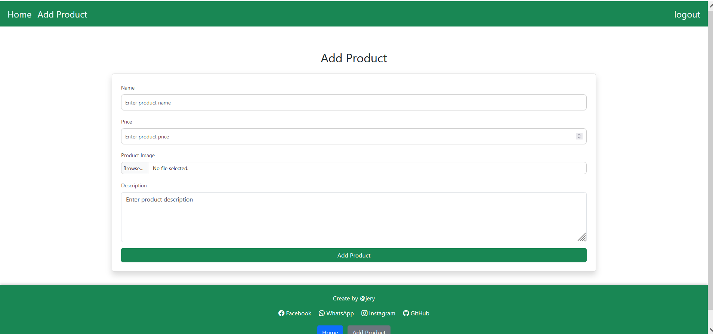

# E-Commerce Website

Website E-Commerce ini dibangun menggunakan **Node.js**, **Express.js**, dan **EJS** sebagai template engine untuk merender halaman dinamis. Website ini juga menggunakan **MySQL** sebagai database untuk menyimpan data produk, pengguna, dan transaksi.

## Teknologi yang Digunakan

- **Node.js**: Platform JavaScript untuk membangun aplikasi backend yang cepat dan skalabel.
- **Express.js**: Framework minimalis untuk Node.js yang digunakan untuk menangani routing dan middleware.
- **EJS (Embedded JavaScript)**: Template engine untuk merender halaman dinamis dengan data yang berasal dari backend.
- **MySQL**: Database relasional untuk menyimpan data produk, pengguna, dan transaksi.

## Fitur Utama

- **Pengelolaan Produk**: Menambahkan, mengedit, dan menghapus produk dalam website.
- **Autentikasi Pengguna**: Pengguna dapat mendaftar, login, dan mengelola akun mereka.
